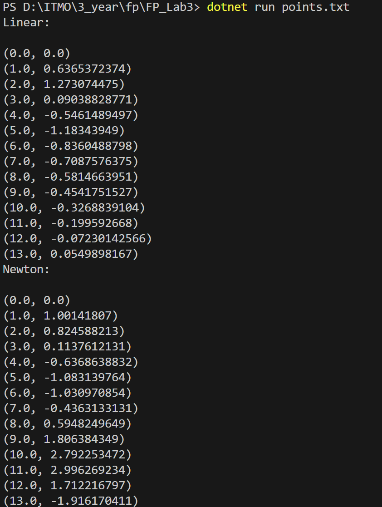
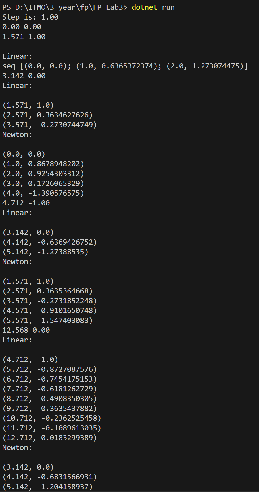

# FP_Lab3

Сафонова Ольга Данииловна | F# | 368764

---

Примеры использования:

Пример с применением args:



Пример с применением стандартного ввода:



---

Остановка - ctrl+c

---

Линейная интерполяция и интерполяция Ньютона.

Линейная интерполяция:
```
let linearInterpolationFunc (x0: float) (y0: float) (x1: float) (y1: float) (x: float) =
    y0 * (x1 - x) / (x1 - x0) + y1 * (x - x0) / (x1 - x0)

let prepareXY (x: seq<float>) (y: seq<float>) =
    let xy = Seq.zip x y
    Seq.pairwise xy

let rec linearInterpolation xyPairs (currentStep: float) (incStep: float) =
    match Seq.length xyPairs with
    | 0 -> Seq.empty
    | _ ->
        let newY =
            linearInterpolationFunc
                (fst (fst (Seq.head xyPairs)))
                (snd (fst (Seq.head xyPairs)))
                (fst (snd (Seq.head xyPairs)))
                (snd (snd (Seq.head xyPairs)))
                currentStep

        let resultSeq = seq { yield (currentStep, newY) }

        if currentStep >= (fst (fst (Seq.head xyPairs)))
           && currentStep <= (fst (snd (Seq.head xyPairs))) then
            Seq.append resultSeq (linearInterpolation xyPairs (currentStep + incStep) incStep )
        else
            Seq.append
                resultSeq
                (linearInterpolation (Seq.tail xyPairs) (currentStep + incStep) incStep)
```

Интерполяция Ньютона:
```
let swapSeq someSeq =
    Seq.append (Seq.tail someSeq) (Seq.singleton (Seq.head someSeq))

let takeHeadSeq someSeq = 
    Seq.take ((Seq.length someSeq) - 1) someSeq

let rec down xy (currentX:float) =
    match Seq.length xy with
    | 1 -> (currentX - fst (Seq.head xy))
    | _ -> (currentX - fst (Seq.head xy)) * (down (Seq.tail xy) currentX)

let rec coefs xy repeats:float =
    match repeats with
    | 1 -> (snd (Seq.head xy)) / (down (Seq.tail xy) (fst (Seq.head xy)))
    | _ -> (snd (Seq.head xy)) / (down (Seq.tail xy) (fst (Seq.head xy))) + (coefs (swapSeq xy) (repeats-1))

let rec xFunc (xy:seq<float*float>) currentX =
    match Seq.length xy with
        | 1 -> (currentX - fst (Seq.last xy))
        | _ -> (currentX - fst (Seq.last xy)) * (xFunc (Seq.take ((Seq.length xy) - 1) xy) currentX)

let rec newtonInterpolationFunc xy currentX =
    match Seq.length xy with
    | 1 -> snd (Seq.head xy)
    | _ -> 
        let currentCoef = coefs xy (Seq.length xy)
        let currentxFunc = xFunc (takeHeadSeq xy) currentX
        (currentCoef)*(currentxFunc) + (newtonInterpolationFunc (takeHeadSeq xy) currentX)

let rec newtonInterpolation xy currentStep incStep =
    if currentStep < fst (Seq.last xy) then
        let nextValue = newtonInterpolation xy (currentStep + incStep) incStep
        let currnetValue = seq{currentStep, newtonInterpolationFunc xy currentStep}
        Seq.append currnetValue nextValue
    else
        seq{currentStep, newtonInterpolationFunc xy currentStep}
```